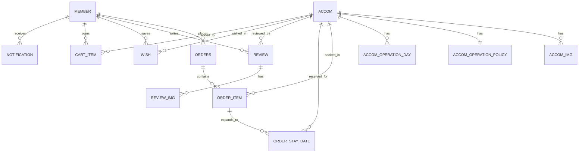

# Accommodation

> Spring Boot 기반 숙소 예약 및 탐색 웹 애플리케이션  
> 숙소 검색, 상세 조회, 장바구니, 주문, 찜, 리뷰, 관리자 기능과 외부 API 연동을 포함한 통합 서비스입니다.

---

## 목차

1. [프로젝트 소개](#1-프로젝트-소개)
2. [기술 스택](#2-기술-스택)
3. [실행 방법](#3-실행-방법)
4. [프로젝트 구조](#4-프로젝트-구조)
5. [주요 기능](#5-주요-기능)
6. [데이터베이스 구조](#6-데이터베이스-구조)
7. [주요 URL 흐름](#7-주요-url-흐름)
8. [테스트 및 빌드](#8-테스트-및-빌드)
9. [역할 분담](#9-역할-분담)
10. [주의 사항](#10-주의-사항)

---

## 1. 프로젝트 소개

| 항목 | 내용 |
|------|------|
| 프로젝트명 | Accommodation |
| 유형 | 숙소 예약 및 탐색 플랫폼 |
| 백엔드 | Spring Boot + Spring MVC + JPA |
| 프론트엔드 | Thymeleaf, CSS, JavaScript |
| 데이터베이스 | MySQL |
| 배포 산출물 | WAR |
| 핵심 목표 | 숙소 탐색부터 예약, 리뷰, 찜, 관리자 운영까지 하나의 서비스 흐름으로 제공 |

### 사용자 관점 핵심 기능

**일반 회원**

- 숙소 메인/카테고리/검색 페이지 조회
- 숙소 상세 페이지 확인 및 최근 본 숙소 조회
- 회원가입, 로그인, 소셜 로그인, 마이페이지 사용
- 장바구니 추가, 주문/예약 진행, 주문 내역 조회
- 찜 목록 관리 및 리뷰 작성

**관리자**

- 관리자 페이지에서 숙소 관리
- 회원 관리 및 상세 정보 조회
- 주문 관리 및 운영 현황 확인

---

## 2. 기술 스택

| 구분 | 기술 |
|------|------|
| Language | Java 21 |
| Framework | Spring Boot 3.4.3, Spring MVC |
| Security | Spring Security, OAuth2 Client, JWT |
| Template | Thymeleaf, Thymeleaf Layout Dialect |
| Database | MySQL, H2(test) |
| ORM | Spring Data JPA, Querydsl |
| Storage | AWS S3 |
| Build | Gradle |
| Test | JUnit 5, Spring Boot Test, Spring Security Test |

---

## 3. 실행 방법

### 사전 요구사항

- JDK 21
- MySQL 8 이상
- Gradle Wrapper 사용 권장

기본 포트는 `8082`입니다.

### 환경 변수

`src/main/resources/application.properties` 기준으로 아래 값이 필요합니다.

```env
DB_URL=
DB_USERNAME=
DB_PASSWORD=
JWT_SECRET=
GOOGLE_CLIENT_ID=
GOOGLE_CLIENT_SECRET=
KAKAO_CLIENT_ID=
KAKAO_CLIENT_SECRET=
cloud.aws.credentials.access-key=
cloud.aws.credentials.secret-key=
tour.api.service-key=
odsay.api.key=
odsay.api.web-key=
naver.map.client.id=
```

선택 설정:

- `admin.bootstrap.email`
- `admin.bootstrap.password`
- `admin.bootstrap.name`
- `admin.bootstrap.number`
- `admin.bootstrap.address`

애플리케이션 시작 시 관리자 계정이 없으면 기본값으로 관리자 계정을 자동 생성합니다.

### 실행 순서

```bash
# 1. 프로젝트 루트로 이동
cd Accommodation

# 2. 애플리케이션 실행
./gradlew bootRun
```

Windows에서는:

```powershell
.\gradlew.bat bootRun
```

접속 주소:

- 메인 페이지: `http://localhost:8082`

---

## 4. 프로젝트 구조

```text
Accommodation/
├─ src/main/java/com/Accommodation
│  ├─ config        # 보안, S3, 감사, 관리자 계정 초기화
│  ├─ controller    # 웹 요청 처리
│  ├─ dto           # 데이터 전달 객체
│  ├─ entity        # JPA 엔티티
│  ├─ exception     # 예외 처리
│  ├─ repository    # DB 접근 계층
│  ├─ scheduler     # 예약 상태 스케줄러
│  ├─ service       # 비즈니스 로직
│  ├─ util          # 공통 유틸리티
│  └─ validation    # 입력 검증
├─ src/main/resources
│  ├─ templates     # Thymeleaf 템플릿
│  ├─ static        # CSS, JS, 이미지
│  └─ application.properties
├─ src/test         # 테스트 코드 및 테스트 설정
├─ docs/erd.dbml    # ERD 원본
├─ build.gradle
└─ README.md
```

---

## 5. 주요 기능

### 숙소 탐색

- 메인 페이지에서 숙소 목록 조회
- 호텔, 리조트, 펜션, 모텔, 게스트하우스 카테고리별 탐색
- 검색 조건 기반 숙소 조회

### 예약 및 주문

- 숙소 상세 조회
- 예약 가능일 및 월별 가능 여부 조회
- 장바구니 담기
- 주문 생성 및 주문 이력 조회

### 회원 기능

- 회원가입 및 로그인
- Google, Kakao OAuth2 로그인
- 마이페이지 정보 수정 및 비밀번호 변경
- 최근 본 숙소 조회

### 사용자 활동

- 숙소 찜 등록 및 찜 목록 관리
- 리뷰 작성 및 리뷰 조회
- 알림 확인

### 부가 기능

- 지역별 액티비티 페이지 제공
- 숙소 기준 교통 정보 페이지 제공
- AWS S3 기반 이미지 업로드

### 관리자 기능

- 숙소 등록, 수정, 관리
- 회원 관리
- 주문 관리

---

## 6. 데이터베이스 구조

현재 JPA 엔티티 기준으로 정리한 핵심 테이블 관계입니다.



### 관계 요약

| 관계 | 설명 |
|------|------|
| `Member` → `Order` | 1:N, 회원은 여러 주문 생성 가능 |
| `Order` → `OrderItem` | 1:N, 주문은 여러 예약 항목 포함 가능 |
| `OrderItem` → `OrderStayDate` | 1:N, 예약 항목의 실제 숙박 날짜 관리 |
| `Accom` → `AccomImg` | 1:N, 숙소 이미지 관리 |
| `Accom` → `AccomOperationPolicy` | 1:1, 숙소 운영 정책 |
| `Accom` → `AccomOperationDay` | 1:N, 날짜별 운영일 관리 |
| `Member` → `Review`, `Accom` → `Review` | 각각 1:N, 회원이 숙소 리뷰 작성 |
| `Review` → `ReviewImg` | 1:N, 리뷰 이미지 관리 |
| `Member` → `Wish`, `Accom` → `Wish` | 각각 1:N, 찜 기능 |
| `Member` → `CartItem`, `Accom` → `CartItem` | 각각 1:N, 장바구니 기능 |
| `Member` → `Notification` | 1:N, 사용자 알림 |

실제 ERD 문서화 원본은 [docs/erd.dbml](C:\tpro\Accommodation\docs\erd.dbml)입니다. `dbdiagram.io`에 붙여 넣으면 시각화할 수 있습니다.

---

## 7. 주요 URL 흐름

| Method | URL | 설명                     |
|--------|-----|------------------------|
| `GET` | `/`, `/main` | 메인 페이지                 |
| `GET` | `/main/hotels` | 호텔 카테고리 페이지            |
| `GET` | `/main/resorts` | 리조트 카테고리 페이지           |
| `GET` | `/main/pensions` | 펜션 카테고리 페이지            |
| `GET` | `/main/motels` | 모텔 카테고리 페이지            |
| `GET` | `/main/guesthouses` | 게스트하우스 카테고리 페이지        |
| `GET` | `/searchList` | 검색 결과 페이지              |
| `GET` | `/accom/**` | 숙소 상세 관련 페이지           |
| `GET` | `/recent-viewed` | 최근 본 숙소 페이지            |
| `GET` | `/transport` | 교통 정보 페이지              |
| `GET` | `/activities/{region}` | 지역별 즐길거리 페이지           |
| `GET`, `POST` | `/members/**` | 회원가입, 로그인, 마이페이지 관련 기능 |
| `GET`, `POST` | `/orders/**` | 주문 및 예약 관련 기능          |
| `GET`, `POST` | `/reviews/**` | 리뷰 기능                  |
| `GET`, `POST` | `/wish/**` | 찜 기능                   |
| `GET`, `POST` | `/cart/**` | 장바구니 기능                |
| `GET`, `POST` | `/admin/**` | 관리자 기능                 |

---

## 8. 테스트 및 빌드

### 테스트

```bash
./gradlew test
```

Windows:

```powershell
.\gradlew.bat test
```

현재 로컬에서 `.\gradlew.bat test` 기준 테스트는 통과했습니다. 테스트 프로필은 H2를 사용합니다.

### 빌드

```bash
./gradlew build
```

빌드 결과물:

- `build/libs/Accommodation-0.0.1-SNAPSHOT.war`
- `build/libs/Accommodation-0.0.1-SNAPSHOT-plain.war`

GitHub Actions workflow는 `main`, `develop` 브랜치의 `push` 및 `pull_request`에서 Gradle 빌드를 실행합니다.

---

## 9. 역할 분담

| 이름 | 역할 | 담당 영역 |
|------|------|----------|
| 작성 예정 | 작성 예정 | 작성 예정 |
| 작성 예정 | 작성 예정 | 작성 예정 |
| 작성 예정 | 작성 예정 | 작성 예정 |
| 작성 예정 | 작성 예정 | 작성 예정 |

---

## 10. 주의 사항

- 저장소 루트의 `application-local.properties`에 실제 비밀값이 있다면 Git 추적에서 제외하고 별도 비밀 관리 방식으로 옮기는 편이 안전합니다.
- OAuth2, 지도, 교통, 관광 API 키가 없으면 일부 기능은 비활성화되거나 정상 동작하지 않을 수 있습니다.
